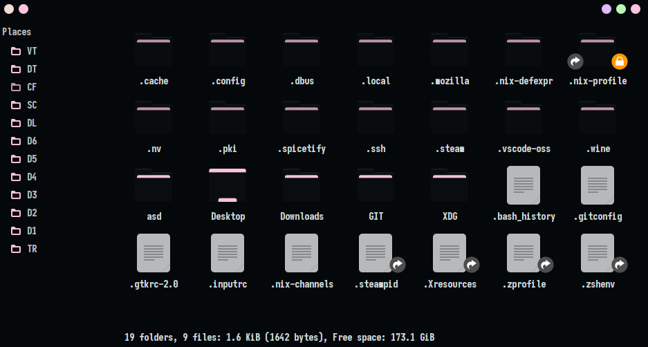

# SAGA GTK theme
A Dark theme with colourful shades of pastel for GTK3

## Installation
Clone the repository and move the theme folders into ~/.themes
`mkdir ~/.themes`
`git clone https://github.com/SAGAtheme/GTK.git`
`cd GTK && cp -r SAGA-* ~/.themes` 

Move the icons into ~/.icons
`mkdir ~/.icons`
`mv -r SAGACONS ~/.icons`

## License

[MIT License](./LICENSE)

